This project involves reverse engineering the Thrustmaster T248 steering wheel with the ultimate goal of enabling custom steering wheel builds.
Removing the Steering Wheel

## Project Update (December 2025)

Further analysis using an oscilloscope allowed me to observe the full startup sequence
as well as additional protocol frames that i wasnt able to capture with my logic analyzer.

Based on these new findings, I was able to implement a fully working **wheel emulator**,
which allows a **custom-built steering wheel** to operate with the Thrustmaster T248 wheelbase.

All new insights have been **integrated directly into this README**.
Most updates can be found in:
- **The Communication Protocol**
- **Wheel Emulator (new section)**

## Table of Contents
- [Current Project State](#current-project-state)
- [Wheel Emulator](#wheel-emulator)
  - [Development Versions (V1.x)](#development-versions-v1x)
    - [V1.0 – Minimal Emulator](#v10--minimal-emulator)
    - [V1.1 – Button Control via Serial Console](#v11--button-control-via-serial-console)
    - [V1.2 – Improved Button Transmission](#v12--improved-button-transmission)
    - [V1.3 – UART State Machine \& Encoder Decoding](#v13--uart-state-machine--encoder-decoding)
    - [V1.4 – Hardware Integration Improvements](#v14--hardware-integration-improvements)
    - [V1.5 – Encoder Hardware \& OLED Display](#v15--encoder-hardware--oled-display)
    - [V1.6 – Startup Acknowledgment Check](#v16--startup-acknowledgment-check)
    - [V1.7 – UART Receive Timeout](#v17--uart-receive-timeout)
    - [V1.8 – Full Button Set](#v18--full-button-set)
  - [V2.0 – Stable Wheel Emulator](#v20--stable-wheel-emulator)
  - [Steering\_Wheel\_USB (Legacy)](#steering_wheel_usb-legacy)
- [Disassembling the Wheel](#disassembling-the-wheel)
- [The PCB](#the-pcb)
- [Interesting Details in the Schematic](#interesting-details-in-the-schematic)
- [The Wheel’s Connection to the Wheelbase](#the-wheels-connection-to-the-wheelbase)
- [The Communication Protocol](#the-communication-protocol)
    - [Overview](#overview)
    - [Keep-Alive Messages](#keep-alive-messages)
    - [Button State Messages](#button-state-messages)
    - [General Data Frames](#general-data-frames)
      - [Encoder Data Analysis](#encoder-data-analysis)
    - [Startup Sequence](#startup-sequence)
    - [Shutdown Sequence](#shutdown-sequence)
    - [Screen Data](#screen-data)
- [The Wheelbase](#the-wheelbase)
- [The Screen](#the-screen)
- [The Encoders](#the-encoders)
- [The Firmware](#the-firmware)
- [Pedal Set](#pedal-set)
- [Research Status](#research-status)
  - [Resolved Questions](#resolved-questions)
    - [Startup Sequence Analysis](#startup-sequence-analysis)
    - [Keep-Alive Messages](#keep-alive-messages-1)
    - [Button State Messages](#button-state-messages-1)
    - [General Data Frames (F3)](#general-data-frames-f3)
  - [Open Questions](#open-questions)
    - [PA14 Functionality](#pa14-functionality)
    - [Screen Data Decoding](#screen-data-decoding)
    - [Firmware Dump \& Update Process](#firmware-dump--update-process)
    - [Protocol Design Decisions](#protocol-design-decisions)
- [Goal](#goal)

# Current Project State

- The T248 wheel communication protocol is largely understood.
- A fully working wheel emulator has been implemented on RP2040 (without screen data like rpm, gear, lap-time, etc).
- Custom steering wheels can now be used with a stock T248 wheelbase.
- Remaining unknowns are mostly related to display decoding and firmware updates.

# Wheel Emulator
The wheel emulator is implemented using the **Arduino IDE** on a **Raspberry Pi Pico (RP2040)**.

The development process was intentionally iterative:
- **V1.x** versions were used to incrementally reverse engineer and validate
  individual protocol features.
- **V2.0** is the first **fully functional wheel emulator**.

Earlier in the project, a separate **USB-only custom wheel implementation**
was created.

---

## Development Versions (V1.x)

### V1.0 – Minimal Emulator

Implements:
- Startup sequence
- Periodic keep-alive messages
- Button state messages

This version prevents the wheelbase from continuously generating
phantom **DPAD-Up** inputs when no wheel is connected.

**Hardware notes:**
- UART RX/TX must be connected to the wheelbase
- Wheelbase 3.3 V is connected to GPIO 11 as an enable signal  
  (external pull-down resistor required)
- The Pico must be powered **before** the wheelbase
- The Pico must be connected to a separate USB port for power

---

### V1.1 – Button Control via Serial Console

Adds interactive button control via the USB serial console.

**Commands:**
- `'1'–'10'`, `'13'`, `'22'`, `'23'` → normal buttons
- `'dr'`, `'du'`, `'dl'`, `'dd'` → DPAD directions
- `'elu'`, `'eld'`, `'eru'`, `'erd'` → encoder directions  
  (example: `elu` = encoder left up)
- `'display'` → display button
- `'mode'` → mode button

⚠️ **Warning:**  
Using the *Display* and *Mode* buttons can modify wheel settings
without visual feedback. Use with caution.

At this stage, buttons were toggled.
This caused encoder-related inputs (`eru`, `erd`) to appear as
periodic pulses in Windows after some time.

---

### V1.2 – Improved Button Transmission

Introduces:
- `void sendButtons(bool full)` function

Behavior:
- `full = true` → sends both B0 and B1 frames
- `full = false` → sends only B0

Additionally, the B0 frame is transmitted immediately after a serial command.

---

### V1.3 – UART State Machine & Encoder Decoding

Implements:
- UART receive state machine to parse multiple frame types
- Buttons are now **momentary presses (100 ms)** instead of toggles
- Screen data is forwarded to the serial console for debugging
- Encoder data decoding based on selected bits from the **F3 frame**

---

### V1.4 – Hardware Integration Improvements

Changes:
- Switched from `uart1 (Serial2)` to `uart0 (Serial1)`
  to match an existing USB steering wheel design
- Wheelbase reset line is now used to control Pico startup

**Reset signal inversion:**
- Wheelbase RESET is **active high**
- Pico RUN pin is **active low**

Implemented using a **BC548B NPN transistor**:
- Collector → Pico RUN
- Emitter → GND
- Base → wheelbase RESET via 10 kΩ resistor

Additionally:
- Implemented responses to screen data frames  
  (no observable effect on wheelbase behavior)

---

### V1.5 – Encoder Hardware & OLED Display

Adds:
- Physical rotary encoder as encoder input
- 32×128 OLED display to show current encoder layer

Encoder layers renamed to:
- TC
- ABS
- BB
- ECU

(The *Display EXP* encoder position is not used.)

**Required libraries:**
- [Adafruit SSD1306](https://github.com/adafruit/Adafruit_SSD1306)
- [RPI_PICO_TimerInterrupt (khoih-prog)](https://github.com/khoih-prog/RPI_PICO_TimerInterrupt)
- [Rotary (buxtronix)](https://github.com/buxtronix/arduino/tree/master/libraries/Rotary)

---

### V1.6 – Startup Acknowledgment Check

Adds:
- Validation of the wheelbase acknowledgment after startup
- If not received, the Pico reboots

(Note: likely redundant, as the wheelbase usually requires a reboot as well.)

---

### V1.7 – UART Receive Timeout

Implements:
- Timeout-based reset of the UART receive state machine
- Prevents lock-ups caused by incomplete or corrupted frames

---

### V1.8 – Full Button Set

Adds support for:
- Buttons 1–10, 13, 22, 23
- Full DPAD support

Details:
- Buttons 1 and 2 use **interrupts** (preferred for shift paddles)
- I²C pins changed to **GPIO 8 and 9**

---

## V2.0 – Stable Wheel Emulator

Finalized version with:
- Shortened interrupt service routines
- Fixed multiple potential race conditions and edge cases
- Added preprocessor flag `DEBUG`
  - Allows all debug output and serial commands to be disabled

This version is considered the **first working emulator**
and is suitable for use with a custom-built steering wheel.

**Required libraries:**
- [Adafruit SSD1306](https://github.com/adafruit/Adafruit_SSD1306)
- [RPI_PICO_TimerInterrupt (khoih-prog)](https://github.com/khoih-prog/RPI_PICO_TimerInterrupt)
- [Rotary (buxtronix)](https://github.com/buxtronix/arduino/tree/master/libraries/Rotary)

And the [arduino-pico](https://github.com/earlephilhower/arduino-pico) core from earlephilhower 

---

## Steering_Wheel_USB (Legacy)

USB-only custom steering wheel implementation.

Characteristics:
- Based on V1.8 logic
- Enumerates as a USB gamepad using the **Joystick** library

Known limitations:
- Long interrupt service routines
- Not as optimized as V2.0

Despite these drawbacks, it worked reliably for multiple month.

# Disassembling the Wheel
After the wheel is removed:
   1. Screws: There are 20 large screws and one small screw securing the red band.
        Note: There is an additional screw hidden beneath the red band on the front.
   2. Once all screws are removed, the wheel can be disassembled. Be cautious not to strain the cable (which can be detached from the PCB).
   3. Backside Components: On the backside, you’ll find the magnetic shifters and the cable. If you’ve added a connector to the cable, you can cut the plastic weld around it to remove the cable. If your connector is too large, you might consider using a 6-pin picoblade connector and soldering it to your custom connector.
   4. Other Side: On the opposite side, you’ll see the PCB, encoders, and screens.

# The PCB
   The steering wheel uses rubber dome switches combined with an STM32G030K6 microcontroller to handle button presses and control the screen.
   The shifter pedals utilize Hall sensors.
   I have completely reverse-engineered the PCB and its schematic. Note that the PCB layout is not entirely accurate or to scale.
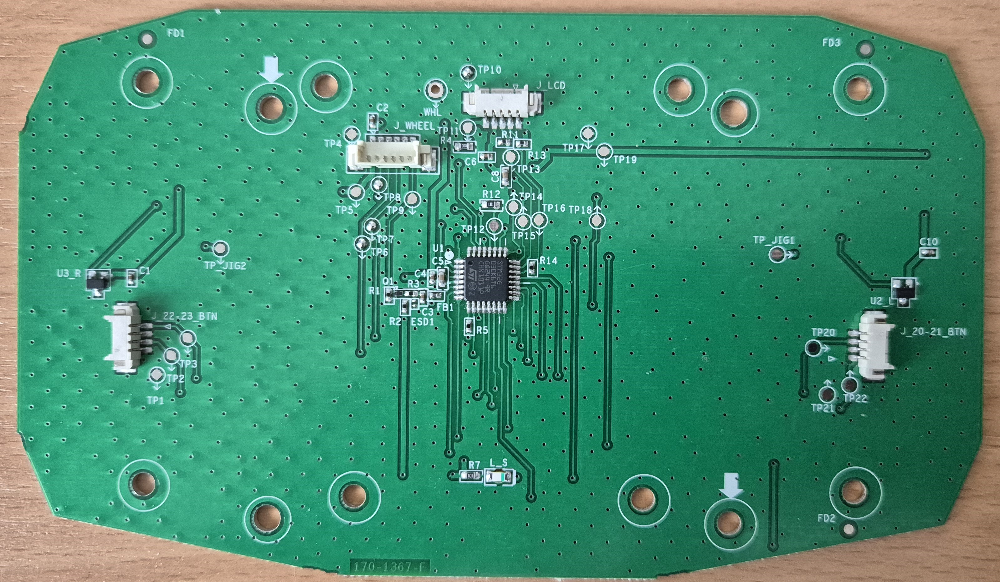 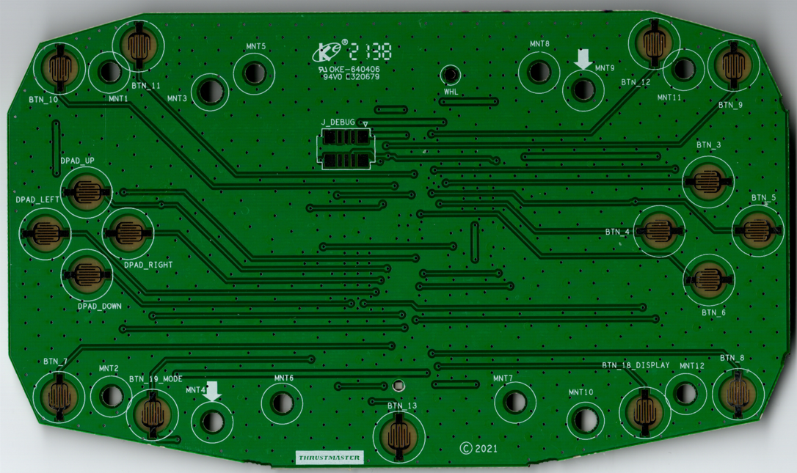
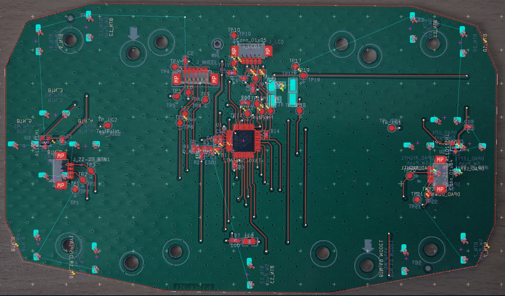 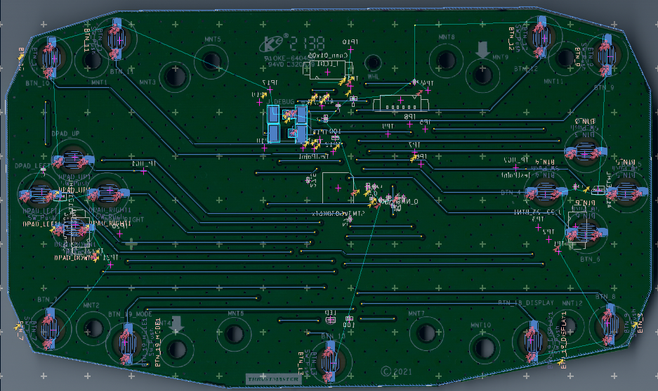 

# Interesting Details in the Schematic
   1. Microcontroller Pin Usage: All pins of the STM32 are utilized, although PB3 is only connected to a 100Ω pull-down resistor.
   2. LED: The LED is connected to PB5. 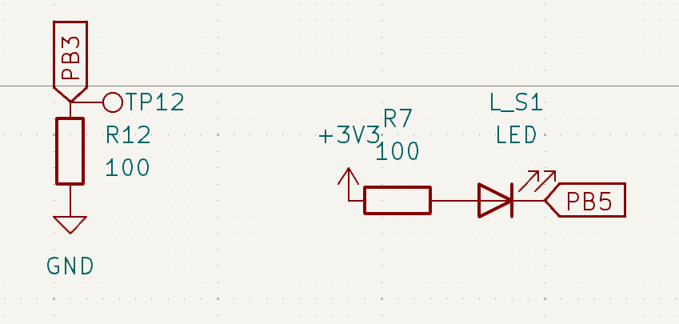
   3. Debug Port: On the backside of the PCB, there are pads for a debug port used to program the STM32. These include NRST, SWCLK (PA14), SWDIO (PA13), 3.3V, and GND. I was unable to dump the firmware—either my ST-Link isn’t working correctly, or SWDIO and SWCLK are being   actively used as button inputs, which might require putting the STM32 into a specific debug state to enable access. More on that in the firmware section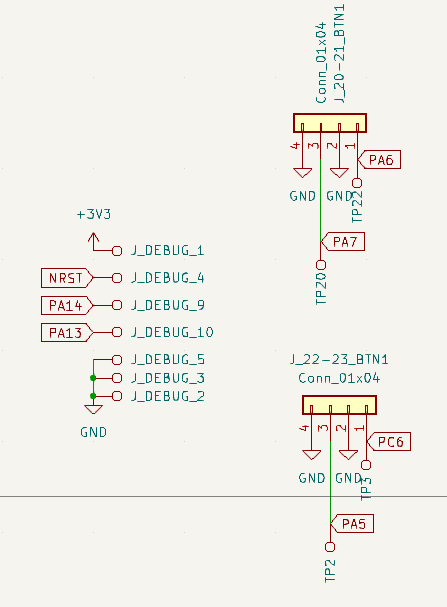
   4. Screen Connections:
        The screen’s SCL is connected to PA11 via a 27.5Ω resistor.
        SDA is connected to PA12.
        Both lines have 4.7kΩ pull-up resistors, and the EDK pin is connected to GND through a 0Ω resistor. 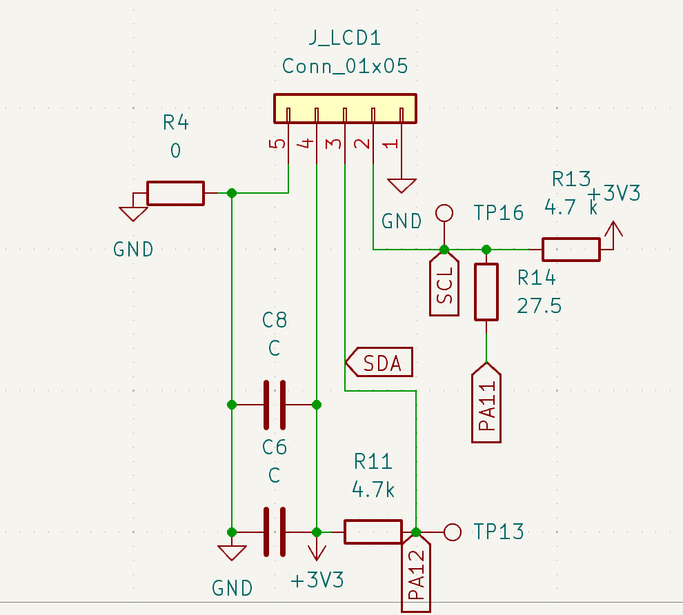
   5. Hall Sensors: The Hall sensors are connected to PB7 and PA4. 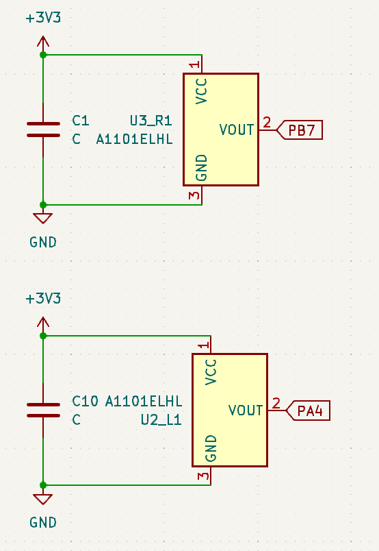
   6. Rubber Dome Buttons: These are connected to PA0, PA1, PA8, PA9, PA10, PA13, PA14, PA15, PB0, PB1, PB2, PB4, PB6, PB8, PB9, PC14, and PC15.
   7. Encoder Buttons:
        PA6 and PA7 are used for BTN 20–21.
        PA5 and PC6 are used for BTN 22–23.
   8. Wheel Connector: This connector is wired to 3.3V, GND, PA14, PA3 (RX), and PA2 (TX) (the latter via a 27.5Ω resistor) as well as NRST (controlled through an N-MOSFET).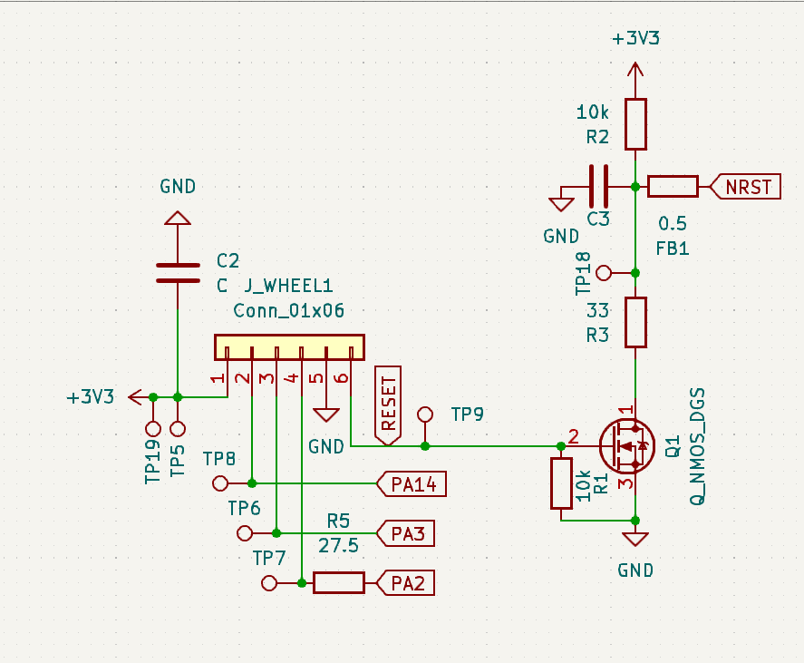

# The Wheel’s Connection to the Wheelbase

Unlike older Thrustmaster wheels (e.g., T300, T150, TMX, T500, etc.) that use SPI—and newer models (e.g., T818) that use CAN-BUS—the T248 and T124 use UART with an even parity bit at 11,520 Baud. The wheel connector has four data pins:

TX (PA2, Testpad 7)
RX (PA3, Testpad 6)
Reset (TP9): Either this pin is used to synchronise the Wheel and the Wheelbase during the startup/calibration sequence, or it is only used for updating the firmware.
PA14 (Testpad 8): This pin can also be pulled high via the Mode Button on the wheel. It is likely used as an normal GPIO for the mode button and during the updating process.

# The Communication Protocol

### Overview
The UART bus handles several message types exchanged between wheel and wheelbase.
Most messages are sent at a base rate of **4 Hz (every 250 ms)** unless otherwise noted.

UART configuration:
- Baud rate: 115200
- Format: 8E1 (even parity)

### Keep-Alive Messages

The wheelbase cyclically sends four different 4-byte frames in sequence:

- D0 00 00 00
- D1 00 FF 01
- D2 00 00 00
- D3 00 00 00

The Order of the frames change every 250 ms (e.g. start with D0 → D1 → D2 → D3, next message D3 → D0 → D1 → D2).

The wheel must respond to **each frame** with:
- F0 00 00 00

⚠️ **Timing requirement:**  
Each keep-alive frame has a timeout of approximately **5 ms**.

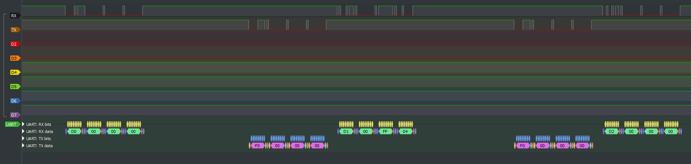
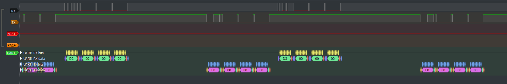

### Button State Messages

The wheel transmits button states without waiting for an acknowledgment.

Two alternating frames are used:
- B0 xx xx xx  → contains button data
- B1 00 00 00 → static placeholder

Only the **B0 frame** is evaluated by the wheelbase.
The button states are encoded in the **B0** frame as follows:

- **Second byte:**  
  DPAD-Right, Display, Mode, Encoder-Left Up, Encoder-Left Down,  
  Encoder-Right Up, Encoder-Right Down, unused (always 0)

- **Third byte:**  
  BTN 9, BTN 10, BTN 22, BTN 23, BTN 13,  
  DPAD-Up, DPAD-Down, DPAD-Left

- **Fourth byte:**  
  BTN 1, BTN 2, BTN 3, BTN 4,  
  BTN 5, BTN 6, BTN 7, BTN 8
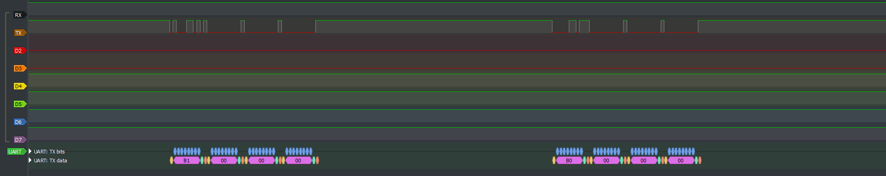

### General Data Frames

In addition to the known message types, the wheelbase sends a general-purpose data frame
used for multiple functions.

Frame length: **18 bytes**  
Example:
F3 0E 00 05 45 20 31 20 2B A0 86 01 00 00 00 00 00

Observations:
- Byte 0–1: static
- Byte 5: message subtype
  - 0x45 → Encoder-related data
  - 0x20 → Default / idle state

This frame is sent:
- randomly in idle mode (non-encoder data)
- immediately after encoder interaction (encoder data)

#### Encoder Data Analysis

The encoder-specific variant of this frame was analyzed in detail
(using the provided Excel analysis file: [Encoder_analysis.xlsx](Encoder_data_analysis/Encoder_analysis.xlsx)).

Decoded fields:
- **Byte 7:** bits 0–2 encode the current encoder layer
- **Byte 9:** identifies the pressed encoder button (EX+, EX-, EXP)
- **Byte 10–11:** encode the encoder action:
  - no action / reset
  - layer switch
  - encoder button press

The emulator decodes these actions by evaluating selected bit combinations.

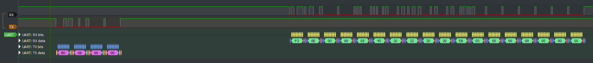

### Startup Sequence

1. After power-up, the wheelbase pulls the **RESET line high for ~400 ms**,
   resetting the wheel’s STM32.
2. ~100 ms later, the wheelbase starts sending keep-alive frames.
   At this stage, the wheel does **not** respond.
3. After another ~100 ms, the wheel finishes booting and sends a static
   “hello” frame **twice**:

   F4 02 00 02 AA E1 FF DE

4. The wheelbase responds to each with:
   F0 00 00 00
5. Normal operation begins:
   - 4 Hz button messages
   - keep-alive frames
   - screen data (if supported by the game)

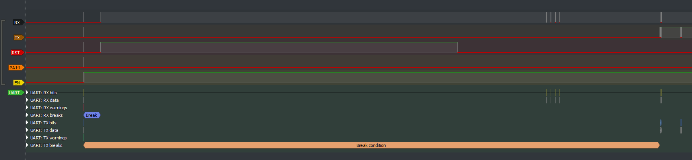

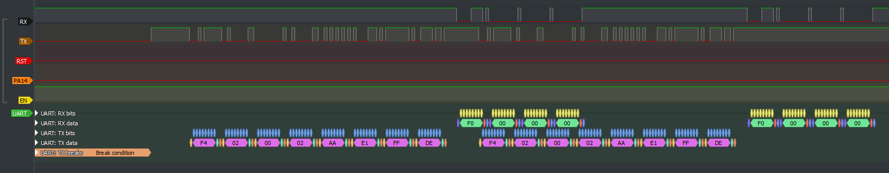

### Shutdown Sequence

When the wheelbase is disconnected from the PC, it sends the following frame twice:

FD 01 00 00

The wheel does not respond.

### Screen Data

The screen data consists of variable-length frames sent from the wheelbase.

Frame structure:
- **Byte 0:** constant (0x2A / 42)
- **Byte 1:** counter (increments every frame)
- **Byte 2:** frame length
- **Remaining bytes:** payload data

The wheel responds with a static 12-byte frame, e.g.:

47 0C 2A 02 01 00 80 00 00 00 00 00

The purpose of this response is currently unclear.
It appears that all bytes except the first may influence the displayed content.

Screen data is only transmitted when a game is running that supports the T248 display.
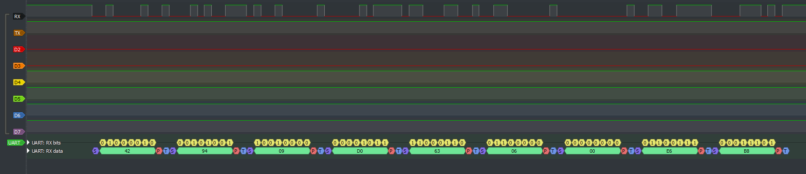
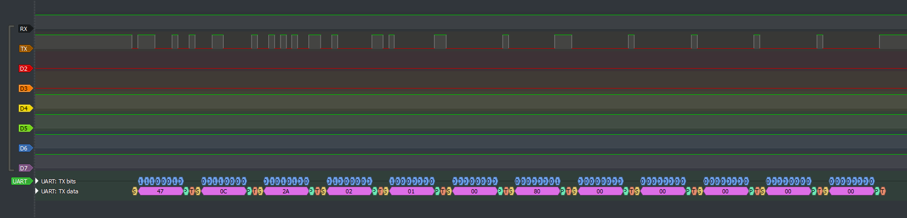

Note that when the wheel is powered on without the wheelbase connected, the communication differs entirely; I will include the Pulseview capture files for further analysis.

# The Wheelbase

The Wheelbase is equipped with an STM32L412CB microcontroller featuring 128KB of Flash memory. I haven’t personally disassembled the wheelbase, but I found these two excellent videos for reference:  
- [Watch here](https://www.youtube.com/watch?v=H18vVQpp1Oo)  
- [Watch here](https://www.youtube.com/watch?v=9dmCC8PAo2E)  

# The Screen
   The screen is a custom I2C LCD that requires five wires: 3.3V, GND, SDA, SCL, and EDK (which is tied to GND). It uses Vinka VK2C23B controller. I have included the datasheet and example code provided by the manufacturer (only in chinese thouh(use google lens))
   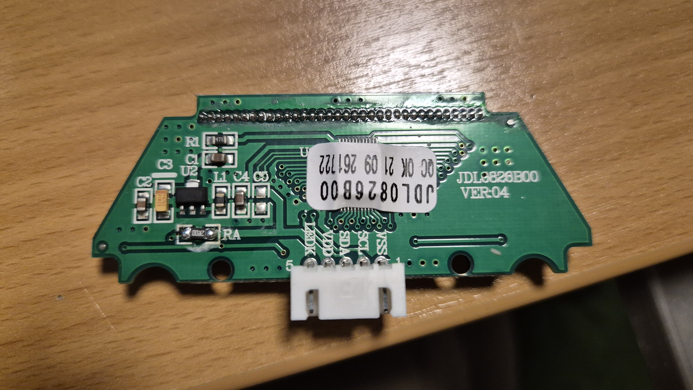

# The Encoders
   The encoders incorporate two standard pushbuttons actuated by a lever.
   You can adjust the tactile feedback of the encoders by tightening the large screw on the back.

# The Firmware

I was unable to dump the firmware via the SWD interface through the J_Debug footprint. This could be due to an issue with my ST-Link or because the SWCLK pin (PA14) is also used for the Mode button and one pin of the connecting wire to the wheelbase. Similarly, SWDIO (PA13) is shared with Button 9. It might be necessary to place the STM32 in a specific debug mode to enable these pins for programming.

The wheelbase firmware can be updated using a Windows program. However, it’s unclear if this process also updates the wheel’s firmware. If it does, it’s likely achieved via the UART interface, potentially involving the Reset line and possibly PA14 (SWCLK).

I found a firmware file in the program's storage directory:  
`C:\Program Files\Guillemot\tmfwupdater\firmware`.  

These files use the `.tmf` extension, which likely stands for "Thrustmaster Firmware." By renaming these files to `.bin`, they can be opened in ST-Link Utility or other compatible software. Interestingly, the firmware file is 260KB in size and contains two distinct program sections:

1. **First Section**:  
   - Approximately 1/3 of the file, starting at the beginning and ending around address `0x00017840`.

2. **Empty Gap**:  
   - A long unused region spanning from `0x00017840` to `0x00037870` (roughly 1/2 of the file).

3. **Second Section**:  
   - Data resumes at `0x00037870`, occupying about 1/10 of the file, and ends at `0x0003E7D0`.

4. **Final Empty Region**:  
   - The remainder of the file (approximately 1/14) is empty, extending to `0x0003F870`.

It’s possible that the first section contains the firmware for the wheelbase, while the second section is for the wheel. Given that the wheelbase microcontroller only has 128KB of Flash memory and the wheel microcontroller only 64KB, this strongly suggests that there are indeed two separate firmware files combined into one.

However, it’s unclear if the wheel’s firmware is first uploaded to the wheelbase and flashed from there or if the PC program flashes both components individually, with the wheelbase acting in a passthrough mode.

This process could likely be understood by analyzing the code of the update program from Thrustmaster, but I currently lack the knowledge to do so.

# Pedal Set
The T248 comes with the T3PM pedal set, which is the successor to the T3PA. While the T3PA uses potentiometers, the T3PM features Hall effect sensors. All older, non-load cell pedal sets (T3PA, T3PM, T2PA, T2PM) use an analog 0–3.3V signal transmitted through an RJ12 port. 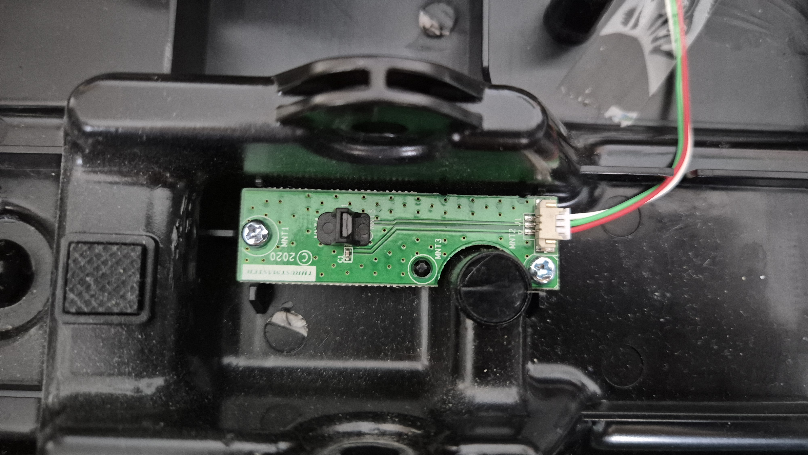

# Research Status

## Resolved Questions

### Startup Sequence Analysis
- The complete startup and handshake sequence has been captured using an oscilloscope.
- The wheel sends a static “hello” frame twice after boot, which must be acknowledged
  before normal operation begins.

### Keep-Alive Messages
- The keep-alive frames are constant.
- Four different frames are sent cyclically at 4 Hz.
- Each frame requires a response within ~5 ms.

### Button State Messages
- Only the B0 frame contains valid button data.
- B1 acts as a placeholder and is not evaluated.
- Button messages do **not** require acknowledgments.
- Button state frames are sent periodically and immediately on state changes.
- Button Frames B0 and B1 dont need to alternate in order.

### General Data Frames (F3)
- F3 frames serve as a multi-purpose container.
- Subtypes are identified via byte 5.
- Encoder-related data is transmitted using specific bit fields within this frame.

## Open Questions

### PA14 Functionality
- PA14 appears to be used during firmware flashing.
- Its exact role (BOOT configuration vs. SWD-related function) is still unclear.

### Screen Data Decoding
- How can individual telemetry values (speed, RPM, lap time, etc.) be extracted?
- What is the purpose of the 12-byte response sent by the wheel?
  Most bytes appear static and may act as a generic acknowledgment.

### Firmware Dump & Update Process
- Is the wheel MCU also updated during a firmware update via the PC software?
- Is it possible to extract both wheelbase and wheel firmware images
  from the PC update package?

### Protocol Design Decisions
- Why was a completely new protocol designed for only two wheel models (T124, T248)?
- Why is the protocol comparatively complex, featuring:
  - Long message formats
  - Acknowledgment-heavy communication
  - Unused headroom in frames
  - Rolling message orders

# Goal

The objective of this project is to emulate a Thrustmaster steering wheel, enabling you to build your own custom wheel. This concept is similar to what Taras demonstrated on his blog (https://rr-m.org/blog/), where he used Arduino code to emulate older Thrustmaster models (T150, TMX, T300, etc.).

I contacted Taras for assistance with identifying the communication protocol (SPI, UART, etc.), and he provided some guidance. However, that was during the early stages of the reverse engineering process, and I have not followed up since.

Most things will probably be similar in the t124 wheel