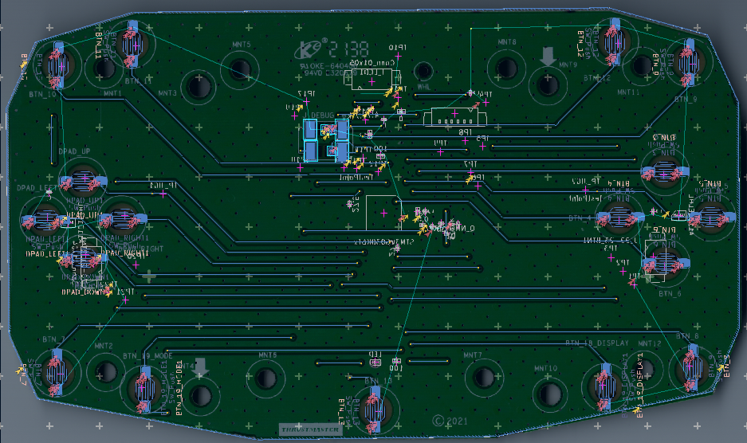

This project involves reverse engineering the Thrustmaster T248 steering wheel with the ultimate goal of enabling custom steering wheel builds.
Removing the Steering Wheel

# Removing the steering wheel from the T248 is straightforward:
(Note this will void your warranty. Do it at your own risk)
   1. Shaft Screws: There are two screws on the shaft. Once these are removed, the wheel can be pulled off.
   2. Caution: This process requires significant force, so take care not to damage the wheel.
   3. Cable: After removal, you'll notice a non-detachable cable connecting the wheel to the wheelbase. I cut this cable and replaced it with a 5-pin DIN connector (using the    shield for ground, since the original cable has 6 wires).

# Disassembling the Wheel

After the wheel is removed:
   1. Screws: There are 20 large screws and one small screw securing the red band.
        Note: There is an additional screw hidden beneath the red band on the front.
   2. Once all screws are removed, the wheel can be disassembled. Be cautious not to strain the cable (which can be detached from the PCB).
   3. Backside Components: On the backside, you’ll find the magnetic shifters and the cable. If you’ve added a connector to the cable, you can cut the plastic weld around it to remove the cable. If your connector is too large, you might consider using a 6-pin picoblade connector and soldering it to your custom connector.
   4. Other Side: On the opposite side, you’ll see the PCB, encoders, and screens.

# The Screen
   The screen is a custom I2C LCD that requires five wires: 3.3V, GND, SDA, SCL, and EDK (which is tied to GND). It uses Vinka VK2C23B controller. I have included the datasheet and example code provided by the manufacturer (only in chinese thouh(use google lens))
   

# The Encoders
   The encoders incorporate two standard pushbuttons actuated by a lever.
   You can adjust the tactile feedback of the encoders by tightening the large screw on the back.

# The PCB
   The steering wheel uses rubber dome switches combined with an STM32G030K6 microcontroller to handle button presses and control the screen.
   The shifter pedals utilize Hall sensors.
   I have completely reverse-engineered the PCB and its schematic. Note that the PCB layout is not entirely accurate or to scale.
 
  

# Interesting Details in the Schematic
   1. Microcontroller Pin Usage: All pins of the STM32 are utilized, although PB3 is only connected to a 100Ω pull-down resistor.
   2. LED: The LED is connected to PB5. 
   3. Debug Port: On the backside of the PCB, there are pads for a debug port used to program the STM32. These include NRST, SWCLK (PA14), SWDIO (PA13), 3.3V, and GND. 
   4. Screen Connections:
        The screen’s SCL is connected to PA11 via a 27.5Ω resistor.
        SDA is connected to PA12.
        Both lines have 4.7kΩ pull-up resistors, and the EDK pin is connected to GND through a 0Ω resistor. 
   5. Hall Sensors: The Hall sensors are connected to PB7 and PA4. 
   6. Rubber Dome Buttons: These are connected to PA0, PA1, PA8, PA9, PA10, PA13, PA14, PA15, PB0, PB1, PB2, PB4, PB6, PB8, PB9, PC14, and PC15.
   7. Encoder Buttons:
        PA6 and PA7 are used for BTN 20–21.
        PA5 and PC6 are used for BTN 22–23.
   8. Wheel Connector: This connector is wired to 3.3V, GND, PA14, PA3 (RX), and PA2 (TX) (the latter via a 27.5Ω resistor) as well as NRST (controlled through an N-MOSFET). 

# The Wheel’s Connection to the Wheelbase

Unlike older Thrustmaster wheels (e.g., T300, T150, TMX, T500, etc.) that use SPI—and newer models (e.g., T818) that use CAN-BUS—the T248 and T124 use UART with an even parity bit at 11,520 Baud. The wheel connector has four data pins:

TX (PA2, Testpad 7)
RX (PA3, Testpad 6)
Reset (TP9)
PA14 (Testpad 8): This pin can also be pulled high via the Mode Button on the wheel. It is likely used by the STM32 to display the correct menu on the screen, while its connection to the wheelbase signals that DPAD button presses should modify the wheel’s settings.

# The Communication Protocol

The UART bus handles three main types of data, all transmitted every 250 ms (4 Hz), although they are not synchronized:

   1. Ping/Keep-Alive Message (Function Uncertain)
        The wheelbase sends four 4-byte messages, and the wheel responds in between.
        The messages are:
        D0 00 00 00, D1 00 FF 01, D2 00 00 00, D3 00 00 00.
        These bytes rotate in order; for example, the sequence starts as D0 D1 D2 D3, then after 250 ms becomes D1 D2 D3 D0, and so on.
        The wheel always responds with:
        F0 00 00 00.

   3. Button States
        The wheel sends button state messages without waiting for a response from the wheelbase.
        These consist of two alternating 4-byte messages:
        B0 00 00 00 and B1 00 00 00.
        The B1 message appears static, while the B0 message uses its last three bytes to represent the state of various buttons:
            The bits indicate the status for:
                First set: DPAD-Right, Display, Mode, Encoder-Left Up, Encoder-Left Down, Encoder-Right Up, Encoder-Right Down
                Second set: BTN 9, BTN 10, BTN 22, BTN 23, BTN 13, DPAD-Up, DPAD-Down, DPAD-Left
                Third set: BTN 1, BTN 2, BTN 3, BTN 4, BTN 5, BTN 6, BTN 7, BTN 8

   4. Screen Data
        The screen data consists of 9 bytes sent from the wheelbase:
            The first byte is a constant (42).
            The second byte is a counter that increments with each display message (e.g., 01, then 02 after 250 ms, etc.).
            The following 7 bytes are data.
        The wheel responds with 12 bytes that appear to be static, though their purpose remains unclear. For example, the response might be:
        47 0C 2A 02 01 00 80 00 00 00 00 00.
        It is possible that all bytes except the first are used for selecting the displayed data.

Additional communication occurs when the wheel is plugged in and completes its setup routine. Unfortunately, I was unable to capture these messages due to limitations with my logic analyzer’s recording duration and trigger. Note that when the wheel is powered on without the wheelbase connected, the communication differs entirely; I will include the Pulseview capture files for further analysis.

# Open Questions
1. PA14 Functionality
   -Is my assumption about its purpose correct, or does it have another role?
2. Startup Sequence Analysis
   -I need help analyzing the protocol during the startup sequence and calibration. My logic analyzer has limitations: it can’t capture long enough sequences, and the trigger functionality isn’t working as needed.
3. Keep-Alive Messages
   -Are these truly constant?
   -Why does the protocol use eight messages in total? Seems a bit excessive.
4. Button State Messages
   -Why are two messages used for button states when all the data is only in one?
   -Why does all messages have a response (like an acknowledgment), but not the buttons states?
5. Screeen Data
   -How can I extract the individual information (Speed, RPM, Laptime, etc.)?
   -Why does the wheel respond with a 12-byte message, and what does it represent? Seems a bit excessive. 
6. General
   -Why was a completely new protocol designed for just two wheels (T124 and T248)?
   -Why is the protocol so complex, with:
      -Long message formats
      -Lengthy acknowledgment sequences
      -Additional unused headroom
      -Rolling message orders

# Goal

The objective of this project is to emulate a Thrustmaster steering wheel, enabling you to build your own custom wheel. This concept is similar to what Taras demonstrated on his blog (https://rr-m.org/blog/), where he used Arduino code to emulate older Thrustmaster models (T150, TMX, T300, etc.).

I contacted Taras for assistance with identifying the communication protocol (SPI, UART, etc.), and he provided some guidance. However, that was during the early stages of the reverse engineering process, and I have not followed up since.

Maybe someone can help me reverse engineer the protocoll or has another idea.

Most things will probably be similar in the t124 wheel
